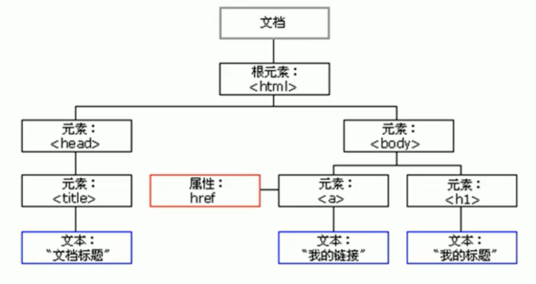
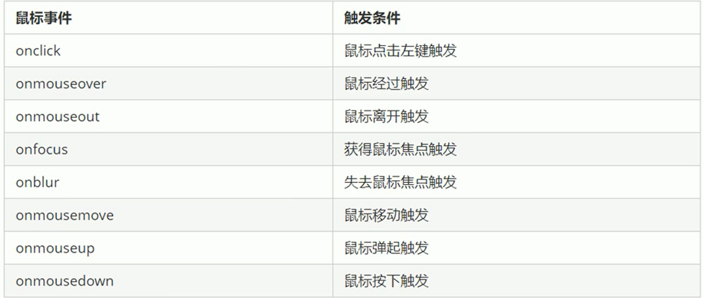
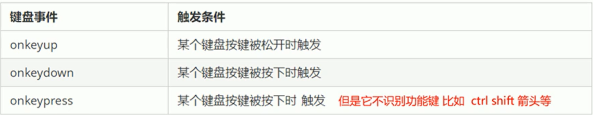
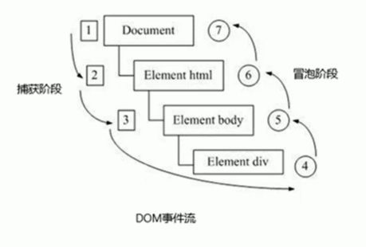
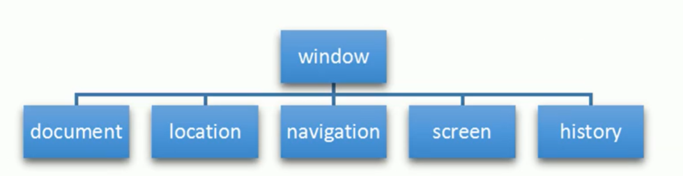

# 												JS笔记

## 一、JS基础特性与语法

### 		1.1 语言特点

​			1.运行在客户端的弱类型脚本语言

​			2.不需要编译，运行过程中由js解释器（js引擎）进行逐行解释执行 (预解析->代码执行)

###  1.2 引入方法

​			1.行内式 	2.内嵌式 	3.外部引入

~~~ js
<link rel="stylesheet" href="./css/index.css">
~~~

### 1.3 常见输入输出方式

~~~ js
prompt("这是一个输入框");
alert("这是一个弹出警示框");
console.log("这是输出到控制台的");
~~~

### 	1.4 JS组成

​			1.ECMAScript（JS语法）（ES5/61）	2.DOM (页面文档对象模型)	3.BOM(.浏览器对象模型)

### 1.5 变量

​			1.变量声明

​				var （函数作用域） let（块级作用域）

​				var可以重复声明相同的变量，后者会覆盖前者，let不能声明相同的变量

​				块级作用域是指用{}包含的区域，常见的有 for，while，if

​			2.尽量不要使用 name 作为变量名，在某些浏览器中有特殊含义

### 1.6  数据类型

​			1.动态弱类型语言，根据右边的数据来确定数据类型

​			2.分类  简单数据类型（Number，String，Boolean，Undefined，Null）复杂数据类型（object）

​			（1）Number

​						1-1 数字型，包括整型和浮点型，默认值为0

​						1-2 八进制 前面加 0 十六进制 前面加 0x

​						1-3 数值中的最大值 Number.MAX_VALUE 1.7979931348623157e+308   

​							  数值中的最小值 Number.MAX_VALUE 5e-324

​							  infinity  代表无穷大    -infinity  代表无穷小    NaN 非数值    isNaN() 用来判断是否为数字 

​				（2）String

​						2-1 单引号和双引号都可用于声明，声明带引号的数据，可以使用外双内单，外单内双都可

​						2-2 字符串转义字符 \n 换行 \t 缩进  \b 空格

​						2-3 length 字符串属性，代表字符串长度 如 str.length  

​						2-4 字符串拼接 字符串拼接，只要拼接中的数据类型有一个是字符串，结果就是字符串

​				（3）Boolean

​						3-1 参与加号运算中时，true当数字 1 来使用，false当数字 0 来使用

​				（4）null

​						4-1 null 是一个空的对象

​				3.使用 typeof 关键字来判断数据类型 用法 typeof +变量名

​				4.数据类型转换

​						（1） 转换为字符串

​								变量.toString（） 			String（变量）强制转换			加号拼接字符串

​						（2）  转换为数字型

​								parseInt（String）将String转换为整型	parseInt（120px） 会保留数字 去掉单位 能取前面的数字

​								parseFloat（String）将String转换为浮点型

​								Number（）强制转换函数

​								隐式转换 - * / 都可以转换为数字型 如 console.log('123' - '120') 结果为 3

​						（3） 转化为布尔型

​								Boolean（x）当x为 ‘ ’ undefined null 0 NaN 时 输出结果都为false

​					5.区别

​						（1）存放方式

​								简单数据类型放到栈中，复杂数据类型放到堆中，栈里存放的简单数据类型是值，存放复杂数据类型

​								 的地址，复杂数据类型的值放到堆里。

​						 （2）传值

​								  简单数据类型传参时只传值，不会对实参产生影响，复杂数据类型传参的时候，实参形参都指向同

​								  一个堆地址，所以对形参进行更改的时候也会对实参产生影响。

### 			1.7运算符

​					1.算数运算符 + - * / %   注意:浮点型数值在进行算数运算符的时候会有精度的问题

​					2.比较运算符

​						注意点：== 会默认转换数据类型，会把字符串型的数据转换为数字型 18=‘18’ 返回为true

​									  === 全等会要求左右两边数据类型和值一样才行 18=‘18’  返回为false

​					3.逻辑运算符

​						 && 逻辑与  || 逻辑或  ！逻辑非

​						 逻辑短路 如果左边条件值已经可以确定结果，则不继续右边条件的判断

​						 &&:如果表达式1为真，则返回表达式2，如果表达式1为假，则返回表达式1

​						 ||：如果表达式1为真，则返回表达式1，如果表达式1为假，则返回表达式1

	###  		 		1.8 流程控制

​					1.顺序流程控制： 从上向下 逐行执行

​					2.分支控制：

​					   （1）根据不同的条件，执行不同的路径代码（多选一）if else  

​					   （2）三元表达式 ：条件表达式? 表达式1：表达式2，若为真，返回表达式1，反之返回表达式2

​					   （3）switch(表达式) 

~~~js
switch(表达式) {
    case value1:
        执行语句1;
        break;
    case value2:
        执行语句2;
        break;
        ...
        default:
        	执行默认的语句;
        //匹配过程相当于全等 ===
        //没有break就不会跳出，一直向下顺序执行
}
~~~

​			3.循环控制

~~~js
for(let i=1;i<=100;i++)
    {
        //循环体
        //推荐使用let初始化变量，作用域只在块级中
    }
while(条件表达式){
    //循环体
}
 do {
     //先执行一遍循环体
 }  while(条件表达式) 
~~~

### 			1.9  数组

​			1.创建数组

​					（1）利用 new 创建数组

~~~js
var arr=new Array(); //创建一个空的数组
~~~

​					（2）利用数组字面量创建数组

~~~ js
var arr = []; // 创建一个空的数组
var arr = ['1',2,true,'4',null] // 数组里可以存放任意数据类型,arr.length 数组长度
~~~

​			2.数组扩容

​					（1）直接修改数组长度，多出来的元素位置由undefined来代替

​					（2）通过增加索引号来直接追加元素

		### 			1.10  函数

​			1.函数声明

~~~ js
function sum(){
    // 需要反复执行的代码块儿
}
var sum = function(){ // 需要反复执行的代码块儿}  // 匿名函数
~~~

​			2.函数参数

~~~ js
function sum(形参1,形参2, ...){
    // 形参可看做是没有值的变量,默认为undefined
    // 如果实参多余形参的个数，以形参为准，形参n个，就取前n个实参，其他用undefined代替
    // 函数内置对象arguments存储了传递的所有实参
    console.log(arguments) //实参伪数组 （具有数组的length 按照索引方式存取 没有真正数组的一些方法 如pop（）push（）等 ）
}
sum(实参1，实参2,...);// 函数调用
~~~

​			3.函数返回值

​			   （1）return 之后的代码不会被执行

​			   （2）return 只会返回一个值，如果有多个值，那么取最后一个

​			   （3）如果函数没有 return，则函数的返回值为undefined

### 			1.11 作用域

​				1.全局作用域

​					是指整个script 标签 或者是一个单独的JS文件

​				2.局部作用域

​					只在函数内部起作用和效果，函数的形参也属于局部变量

​				**注意点1:如果在函数内部没有声明直接赋值的变量也是属于全局变量的**

​				**注点意2：全局变量只有在浏览器关闭的时候才会销毁，占用内存资源，局部变量程序执行完毕就会被销毁**

​				3.作用域链

​					 内部函数访问外部函数的变量，采用的是链式查找的方式来决定取哪个值（就近原则）

~~~ js
var num=10;
function fn(){
    var num=20;
    function fun(){
        console.log(num);//结果为 20
    }
}
~~~

### 			1.12 预解析

​					1.js引擎执行顺序

​						预解析->代码执行

​					2.预解析（变量预解析和函数预解析）

​						（1）js引擎会把js 里面所有的 var 还有 function 提升到当前作用域的最前面

​						（2）**变量预解析把变量声明提升到当前作用域的最前面，不进行赋值操作**

​						（3）**函数预解析把函数声明提升到当前作用域的最前面**（注意函数表达式）

### 			1.13 JS对象

​					1.对象创建

~~~ js
var obj={
    username: 'lzy',
    phone: '18647791216',
    email: '1753856457@qq.com',
    sex: 1,
    helloword: function(){
        console.log('hello world');
    }
var obj= new Object();//创建一个空对象
    
}//对象创建语法格式
console.log(obj.username);
console.log(obj['phone']);
obj.helloworld();//调用方法
~~~

​				2.构造函数

~~~ js
function People(username,uage,usex) {//构造函数名称首字母大写，约定，像java里的类，泛指
    this.name=username;
    this.age=uage;// this 指向内存中新建的对象
    this.sex=usex;
    this.sayHi= function(){
        console.log("hello world")
    }
}
var lzy=new People('lizhiyuan',18,'男');//使用new 关键字来创建对象
console.log(typeof lzy);
lzy.sayHi();
~~~

​			3.遍历对象

~~~ js
for(var key in lzy) {
    console.log(key) //输出属性名
    console.log(lzy[key])//输出属性值
}
~~~

​		4.内置对象

​			(1)	查阅[MDN网站](https://developer.mozilla.org/zh-CN/)来获取api信息

​		  （2）Math（数学对象，有数学常量和常见计算方法）

~~~js
//常见方法与属性
Math.PI//圆周率
Math.floor//向下取整
Math.ceil()//向上取整
Math.round()//四舍五入 就近取整
Math.abs()//绝对值
Math.max()/Math.MIN()//最大值与最小值
~~~

​		 (3) Date(日期对象)

~~~ js
var date=new Date()//返回当前时间 Mon Aug 23 2021 14:13:22 GMT+0800 (中国标准时间)
//时间戳
var date1=+new Date()//返回距1970年一月一日到现在的毫秒数，时间戳 1629699224083
var date2=Date.now()//H5新增 获得时间戳 低版本的浏览器不支持
//时间戳转换时间
var d=parseInt(总秒数/60/60/24)//计算天数
var h=parseInt(总秒数/60/60%24)//计算小时
var m=parseInt(总秒数/60%60)//计算分数
var s=paeseInt(总秒数%60)//计算当前秒数

~~~

​		（4）数组对象

~~~ js
arr instanceof Array //返回true或false 用来判断一个对象是否为一个类的实例
Array.isArray()//判断是否是一个数组,H5新增 ie9以上支持
push()//可以在数组末尾添加一个或多个数组元素,返回的结果是新数组的长度
unshift()//可以在数组前面添加一个或多个数组元素,返回的结果是新数组的长度
pop()//删除数组最后一个元素,返回值为删除的元素
shift()//删除数组第一个元素,返回值为删除的元素
arr.reverse()//翻转数组
arr.sort(function(a,b){//数字
    return a-b;//升序排列
    return b-a;//降序排列
})
arr.indexOf();//返回数组中某一元素的索引，只返回第一个满足条件的索引值，没有该元素返回-1，字符串也可用，还可加一个参数，从那个索引值开始查找
arr.join()//数组转为字符串，实参可填分隔符
concat()//连接两个或多个数组，返回一个新数组
slice(a,b)//截取数组，a为开始索引值，b为结束索引值，负数代表从数组倒数第几个元素的索引值，不会对元素组影响
splice(2,1,"hello","world")//删除从索引值2开始的1个元素，新插入两个元素

~~~

​			（5）字符串对象

~~~ js
var str="hello world";

var temp= new String("hello world");
var str=temp;
//销毁temp,这三步相当于对基本数据类型进行包装
var str="red";
str = "bule";//内存新开辟空间 "blue",指针指向新地址，"red"没有被销毁，拼接字符串也是新开辟字符串
charAt(index)//根据位置返回字符
charCodeAt(index)//返回相应位置的ASCI码
str[index];//H5新增，有兼容性问题，支持ie9以上
substr(startindex,取几个字符);//截取字符串
replace(oldchar,newchar);//替换字符，只替换第一个字符 用正则表达式可以都替换
split(分隔符)//字符串转数组
toUpperCase()//转换为大写
toLowerCase()//转换为小写
~~~

### 1.14 同步与异步

​		1.js执行机制

​			（1）先执行执行栈中的同步任务

​			（2）异步任务（回调函数 dom事件，ajax）放到任务队列中,需要事件触发之后才会放到任务队列，队列先进先出

​			（3）一旦执行栈中的所有同步任务都执行完毕，系统就会按照次序读取任务队列中的异步任务，于是被读取的异					 步任务结束等待状态，进入执行栈，开始执行，主线程从任务队列不断获取任务的过程叫做事件循环。

### 1.15  自调用函数（立刻执行函数）

~~~ js
(function(){形参})(实参);//语法格式，多个自调用函数用分号隔开，最大的作用就是独立创建了一个作用域
~~~

# 二、Web Apis

		## 		2.1 MDN web api

​					[MDN WEB APIS](https://developer.mozilla.org/zh-CN/docs/Web/API)

			## 		2.2 DOM 

​					1.定义

​						DOM是W3C组织推荐的可扩展标记语言（HTML或者XML）的标准编程接口。

​					2.DOM 树

​						一个页面就是一个文档，文档 document 元素 element 节点（标签，文本，属性，注释）node

​						DOM把以上内容都看做是一个对象。

​						

​					3.获取页面元素的方法

​							（1）根据id获取

~~~js
document.getElementById(id)//id是大小写敏感的,返回的是一个element对象
console.dir(obj)//能够更好的查看对象的属性和方法
~~~

​							（2）根据标签名获取

~~~ js
document.getElementByTagName(标签名)//返回带有指定标签名的对象的集合，以伪数组的形式存储
var ul =document.getElementById('ul');
var li =ul.getElementByTagName('li');//获得ul中的li，父级元素必须是一个确定的元素，必须指明是哪一个元素对象
~~~

​							（3）h5新增

~~~ js
document.getElementByClassName('类名')//类名选择器，返回伪数组
document.querySelector('选择器')//返回指定选择器的第一个元素对象，选择器加符号
document.querySelectorAll('选择器')//返回指定选择器的所有元素对象，选择器加符号
~~~

​							（4）获取特殊元素

~~~ js
var bodyEle=document.body
var htmlEle=document.documentElement
~~~

​							  (5)  元素的一些重要属性

~~~js
element.innerText//元素内容，不识别html标签,可读写，不保留换行和空格
element.innerHtml//元素内容，识别html标签，可读写，保留换行和空格 W3C标准
input.value//改变表单元素的内容
//样式修改
element.style.backgroundColor='pink';//更改样式，属性名使用驼峰命名法
element.className+=' change';//会直接更改元素样式，覆盖原有样式
//H5规定，自定义属性以 date-属性名 这种格式来命名
element.getAttribute(属性) //获取元素属性的值,包括自定义属性
element.dataset//H5新增 获取所有date-命名的自定义属性的对象 ie11才支持
element.setAttribute(属性,值) //更改元素属性的值,包括自定义属性
element.removeAttribute(属性,值) //更改元素属性的值,包括自定义属性
~~~

​					4.事件

 							（1）事件三要素

​									  事件源	事件类型	事件处理程序

~~~ js
var btn=document.getElementById('btn');//谁要被触发，谁就是事件源
btn.onclick=function(){//onclick 事件类型 鼠标点击
    alert('我是一个按钮');//事件处理程序
    this.disable=false;//this代表了事件处理函数的调用者，此处是btn
}
~~~

**keypress是不识别功能键的（退格，enter，小键盘上下左右等）,keydown是识别功能键的**

​					5.节点操作

​							（1）节点分类

​									 元素节点 nodeType=1	属性节点 nodeType=2	文本节点 nodeType=3

​							（2）获取元素节点

~~~js
node.parentNode //获得当前元素最近的父节点，如果找不到返回的就是null
node.childNodes //得到所有的子节点的结合，包括元素节点和文本节点
node.children //得到所有的子元素节点
node.firstElementChild//第一个子元素节点
node.lastElementChild//最后一个子元素节点
node.nextElementSibling//获得下一个兄弟元素节点
node.previousElementSibling//获得上一个兄弟元素节点
document.createElement('tagName')//创建元素节点
node.appendChild(child)//创建一个子元素节点，后面追加
node.insertBefore(child,指定节点)//添加到指定元素的前面
node.removeChild(child)//删除父元素中的节点，返回被删除的节点
node.cloneNode()//克隆当前节点，参数为空或者为false，为浅拷贝，只复制标签，不复制内容，true为深拷贝，内容加子节点都复制
~~~

​			6.事件进阶

​					（1）事件注册

~~~ js
<button onclick="alert('hello')">
btn.onclick=function(){
    alert("hello");
}//传统事件注册，具有唯一性，同一事件只能设置一个，最后的注册函数会覆盖前一个
btns.addEventListen('click',function(){alert('hello')});
eventTarge.addEventListen(type，listener,[useCapture])//w3c推荐使用,同一个元素同一个事件可以注册多个监听器
//type:事件类型字符串，如click、mouseover，不带on
//listener:事件处理函数，事件发生时调用该函数
//useCapture:可选参数，布尔值，默认为false，true是处于dom事件流的捕获阶段，false处于dom事件流的冒泡阶段
//不用匿名函数的话，不要加小括号，直接函数名称即可
~~~

​					(2) 事件解绑

~~~ js
btn.onclick=null;
btn.removerEventListener('click',fn);
~~~

​					(3) dom事件流

​						1.事件发生时会在元素节点之间按照特定的顺序进行传播，这个传播的过程即为dom事件流。

​						2.onclick 和 attachEvent只能得到冒泡阶段

​						3.有些事件是没有冒泡的，比如 onblur、onfocus、onmouseenter、onmouseleave

​					（4）事件对象

~~~js
btn.onclick=function(event){
    //event就是一个事件对象，可以当函数的形参来看,常用e来表示
    //事件对象只有在事件被触发后才会存在，它是系统自动创建的，不需要我们传递参数
    //事件对象是事件的一系列事件相关数据的集合
    e.target//返回触发事件的对象
    e.type//返回事件类型,如click
    //常见鼠标对象属性
    e.clientX//返回鼠标相对于浏览器窗口可视化区的X坐标
    e.clientY//返回鼠标相对于浏览器窗口可视化区的y坐标
    e.pageX//返回鼠标相对于文档页面的X坐标
    e.pageY//返回鼠标相对于文档页面的y坐标
    e.screenX//返回鼠标相对于电脑屏幕的X坐标
    e.screenY//返回鼠标相对于电脑屏幕的y坐标
    //常用键盘对象属性
    e.keyCode//返回按键的ASCII码值，keyup和keydown事件不区分字母大小写
    e.preventDefault();//阻止默认事件行为，如a链接跳转
    e.stopPropagation();//阻止事件冒泡
}
~~~

​					（5）事件委托（事件代理）

​					   		1.原理

​								**不需要给每个子节点单独设置事件监听器，而是将事件监听器设置在父节点上，利用冒泡机制影响每								一个子节点。**

~~~ js
var ul=document.querySelector('ul');
ul.addEventListener('click',function(e){
    e.target.style.backgroundColor='pink';
})
~~~

​						

## 		2.3 BOM

​					1.定义

​						BOM是浏览器对象模型，它提供了独立于内容而与浏览器窗口进行交互的对象，顶级为 window。

​					2.构成

​					

​					（1）window对象是js访问浏览器的一个接口

​					（2）window对象是一个全局对象，定义在全局作用域的变量、函数都会变成window对象的属性和方法。

​					3.常用属性与方法

~~~ js
window.onload=function(){}
window.addEventListener("load",function(){})//窗口加载事件当文档内容完全加载后会触发该事件（包括css，脚本，图像，文件等）
document.addEventListener("DomContentLoaded",function(){})//当dom加载后就会执行

window.onresize=function(){}
window.innerWidth//浏览器宽度
window.innerHeight//浏览器高度
window.addEventListener("resize",function(){})//当窗口大小发生变化时触发

window.setTimeout(回调函数，[延迟的毫秒数]);//延时执行函数，默认时间0，window可以省略
window.setInterval(回调函数，[间隔的毫秒数])//每隔一段时间就去回调函数
window.clearTimeout(定时器标识符)//清除定时器
window.clearInterval(定时器标识符)//清楚定时器

~~~

​				（1）location 对象

~~~ js
//用以获取或设置窗体的url，并且可以用于解析url
location.href//获取url或设置url
location.gost//返回域名
location.port//返回端口
location.pathname//返回路径
location.search//返回参数
location.hash//返回片段 #后面内容 常见于链接 锚点
location.assign(url);//重定向，记录历史网址，可回退
location.replace(url);//不记录历史记录，不可回退
location.reload(boolean);//刷新按钮 true强制刷新，默认false
~~~

​			（2）navigator 对象

~~~ js
//navigator对象包含浏览器相关的信息，最常用的属性是userAgent，该属性可以返回有客户机发送服务器的user-agent的值
//可以用来得到用户请求所用的终端信息，浏览器版本信息等
~~~

​			（3）history 对象

~~~ js
history.back()//回退到上一个页面
history.forward()//前进到下一个页面
history.go(参数)//参数如果是1，则前进一个页面，-1则后退一个页面
~~~

​			4.网页特效制作

​			（1）offset 偏移量

~~~js
element.offsetParent//返回该元素带有定位的父级元素，如果父级元素都没有定位，返回body
element.offsetTop//返回元素相对带有定位父元素的上边框偏移量
element.offsetLeft//返回元素相对带有定位父元素的左边框偏移量
element.offsetWidth//返回自身包括padding、边框、内容区的高度，返回的数值不带单位
element.offsetHeight//返回自身包括padding、边框、内容区的宽度，返回的数值不带单位
//style只能得到行内样式表中的样式值，style.width是带单位的字符串，style.width是不包含padding和border的，这个是可读写的，offset是只读的
//获取位置使用offset，更改大小位置用style
~~~

​		（2）client 客户端

~~~ js
element.clientTop //返回元素上边框大小
element.clientLeft//返回元素左边框大小
element.clientWidth//不包括边框的宽度
element.clientHeight//不包括边框的高度
~~~

​			

​						

​					

​				

​								

​				

​				

​												

​					

​	

